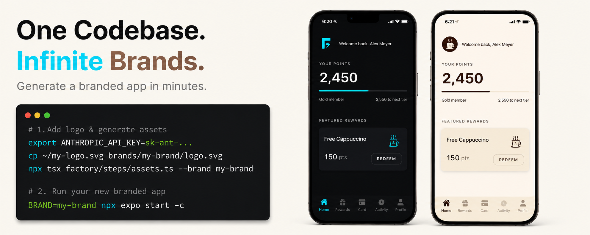

# 🚀 RN Multi Brand Studio

> Generate production-ready, white-label React Native apps from a single Expo codebase.

Drop a logo. Provide a brand name. Get a fully branded mobile app in minutes.



**One Expo codebase. One command. Infinite brands.**

---

## ✨ What is this?

`rn-multi-brand-studio` is an AI-powered white-label app generation pipeline that transforms a generic React Native app into a fully branded, store-ready application.

```
# 1. Export ANTHROPIC key & cmd to generate
export ANTHROPIC_API_KEY=sk-ant-...
cp ~/my-logo.svg brands/my-brand/logo.svg
npx tsx factory/steps/assets.ts --brand my-brand

# 2. Brand new app's ready. Build and test
BRAND=my-brand npx expo start -c
```

The system uses AI + automation to:

- Analyze brand identity from a logo
- Generate a complete design system
- Create app assets
- Validate accessibility
- Generate platform configurations
- Prepare builds and store assets

The goal:

> Build once. Ship unlimited branded apps.

---

## 🎯 The Problem

Building white-label apps usually means:

- Maintaining multiple repositories
- Manually updating themes
- Creating app icons repeatedly
- Managing splash screens
- Repeating store preparation steps
- Risking inconsistent branding

This project explores:

**"Can AI automate the entire white-label mobile app lifecycle?"**

---

## 🏗️ Architecture
