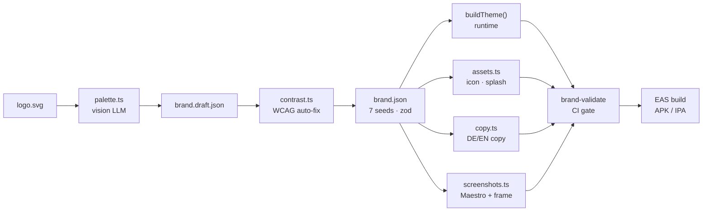

# rn-brand-factory

One React Native codebase. Drop in a logo — AI extracts the brand, themes the app, generates icons, writes DE/EN store copy, captures framed screenshots, and prepares submission.

[](../../actions/workflows/brand-validate.yml)
[](https://expo.dev)
[](tsconfig.json)
[](LICENSE)

<!--
demo.gif: factory new run + 3-brand switch
Recording instructions:
  - Terminal: 120×40, dark theme, font size 14
  - Run: npm run factory -- new --logo ./brands/cafe-aurora/logo.svg --name "Café Aurora" --skip-screenshots
  - Then show: BRAND=cafe-aurora npx expo start -c  (let it load the home screen)
  - Then show: BRAND=gym-forge npx expo start -c    (contrast the color scheme)
  - Capture at 1× retina, export as GIF at 15fps, 800px wide
  - Place result at: docs/demo.gif and update this comment to an img tag
-->

---

## The 60-second brand

Requires `ANTHROPIC_API_KEY` in the environment. Emulator optional (`--skip-screenshots` skips that step).

```bash
npm run factory -- new \
  --logo ./path/to/logo.svg \
  --name "Café Aurora" \
  --tagline "Coffee earns rewards." \
  --skip-screenshots
```

Representative output (durations vary by API latency):

```
Creating brand: Café Aurora (cafe-aurora)
  bundleId : com.rnbrandfactory.cafeaurora
  tagline  : Coffee earns rewards.
  locales  : en, de

  Copied logo → brands/cafe-aurora/logo.svg
  Wrote starter brands/cafe-aurora/brand.json

▶  palette
   ✓ 1 file  (4.2s)

▶  contrast
   ✓ 1 file  (0.3s)

▶  assets
   ✓ 5 files  (2.1s)

▶  copy
   ✓ 10 files  (7.4s)

▶  screenshots  (skipped via --skip-screenshots)

✅  Brand creation complete

  ──────────────┼──────────┼──────────┼──────────────
  Step          │Duration  │Status    │Output
  ──────────────┼──────────┼──────────┼──────────────
  palette       │4.2s      │✓         │1 file
  contrast      │0.3s      │✓         │1 file
  assets        │2.1s      │✓         │5 files
  copy          │7.4s      │✓         │10 files
  screenshots   │—         │skipped   │—
  ──────────────┼──────────┼──────────┼──────────────
```

What lands in `brands/cafe-aurora/`:

```
brands/cafe-aurora/
├── brand.json                   # 7 seed colors + identity
├── logo.svg
├── assets/
│   ├── icon.png
│   ├── adaptive-icon.png
│   ├── adaptive-icon-bg.png
│   ├── splash.png
│   └── favicon.png
├── store/
│   ├── en/
│   │   ├── title.txt
│   │   ├── subtitle.txt
│   │   ├── description.txt
│   │   ├── keywords.txt
│   │   └── releaseNotes.txt
│   └── de/
│       └── … (same 5 files)
└── screenshots/                 # present when emulator available
    ├── en/  01-home.png … 05-profile.png
    └── de/  01-home.png … 05-profile.png
```

Then boot the branded app:

```bash
BRAND=cafe-aurora npx expo start -c
```

---

## How it works



---

## Architecture at a glance

- **Token-only theming, enforced by CI grep.** Raw hex/`fontSize` values are banned outside `src/theme/`. `scripts/check-token-leaks.sh` fails the PR if any leak through. Screens only call `useTheme()`.
- **7 seed colors, full palette derived.** `brand.json` stores only `primary`, `onPrimary`, `secondary`, `accent`, `background`, `surface`, `onSurface`. Everything else — muted variants, borders, tier colors — is computed by `buildTheme()`. Keeps AI extraction tractable.
- **Build-time injection, not dynamic imports.** `app.config.ts` reads `brands/<slug>/brand.json` and writes it into `extra.brand`. `loadBrand.ts` reads `Constants.expoConfig.extra.brand` at runtime. Metro cannot resolve dynamic `require(\`brands/${slug}/…\`)`.
- **Draft → contrast gate → promote.** AI palette goes to `brand.draft.json`. `contrast.ts` runs WCAG AA checks, deterministically adjusts foreground lightness, then writes `brand.json` and deletes the draft. Colors are never committed before the contrast gate.
- **Deterministic cross-check on vision output.** `sharp` quantizes the rasterized logo to dominant pixel clusters. If the LLM primary isn't within ΔE tolerance of any cluster, the deterministic candidate wins.
- **CNG only.** `ios/` and `android/` are never committed. Every brand switch starts from `expo prebuild --clean`. Prevents stale native code diverging across brands.

See [ARCHITECTURE.md](ARCHITECTURE.md) for contracts, data-flow diagram, and risk mitigations.

---

## Honest limitations

- **Spacing and type scale are constant across all brands.** Color and assets differentiate; font size and spacing do not. Adding per-brand type scales is out of scope for this template.
- **Feature list is hardcoded** in `factory/steps/copy.ts`. Store copy reflects the five screens that exist. Extending the app requires updating that list manually.
- **Store submission is staged, not executed.** `fastlane ios_metadata` copies files into `fastlane/metadata/` and runs `deliver`. Credentials and API keys must be supplied by the operator; nothing is committed.
- **Screenshots require a local emulator.** `factory/steps/screenshots.ts` calls `maestro test` against a running Android emulator or iOS simulator. CI skips this step. Use `--skip-screenshots` to skip it locally too.
- **Single language family.** All brands use Inter. Font-per-brand is architecturally possible (the family is a token) but not implemented.

---

## Using this template

1. Click **Use this template** on GitHub, create a new repo.
2. Add required secrets in repo settings → Secrets and variables → Actions:
   - `EXPO_TOKEN` — from [expo.dev/accounts](https://expo.dev/accounts) → Access tokens
   - `ANTHROPIC_API_KEY` is **not** stored as a CI secret; it is only needed for local `factory new` runs.
3. First-run checklist:
   - [ ] Delete the four example brands under `brands/` (or keep `default` as a reference).
   - [ ] Set `BRAND=default` in `eas.json` `preview` and `production` env blocks to your real default slug.
   - [ ] Run `npm install` and `npm run typecheck` to confirm the environment.
   - [ ] Run `npm run factory -- new --logo ./logo.svg --name "My Brand" --skip-screenshots` with your logo.
   - [ ] Run `BRAND=my-brand npx expo start -c` and verify the home screen loads without a red screen.
   - [ ] Open a PR — the `brand-validate` workflow should go green.

---

## Tech stack

| Layer | Choice | Notes |
|---|---|---|
| Framework | Expo SDK 54 + expo-router | CNG only, new arch on |
| Language | TypeScript strict | `noUncheckedIndexedAccess: true` |
| Validation | zod v3 | shared by app and factory |
| Image processing | sharp 0.33 | icons, splash, device framing |
| LLM | claude-sonnet-4-6 via `@anthropic-ai/sdk` | vision palette + store copy |
| Screenshots | Maestro 2.6 | testID-based flows, Pixel 7 / iPhone 15 |
| Fonts | Inter via `@expo-google-fonts/inter` | all brands |
| Builds | EAS Build | `preview` = internal APK/sim, `production` = store |
| CI | GitHub Actions | `brand-validate.yml` + `brand-build.yml` |
| Store delivery | fastlane deliver / supply | metadata staging only |
| CLI | commander 7 | `factory new` chains all steps |
